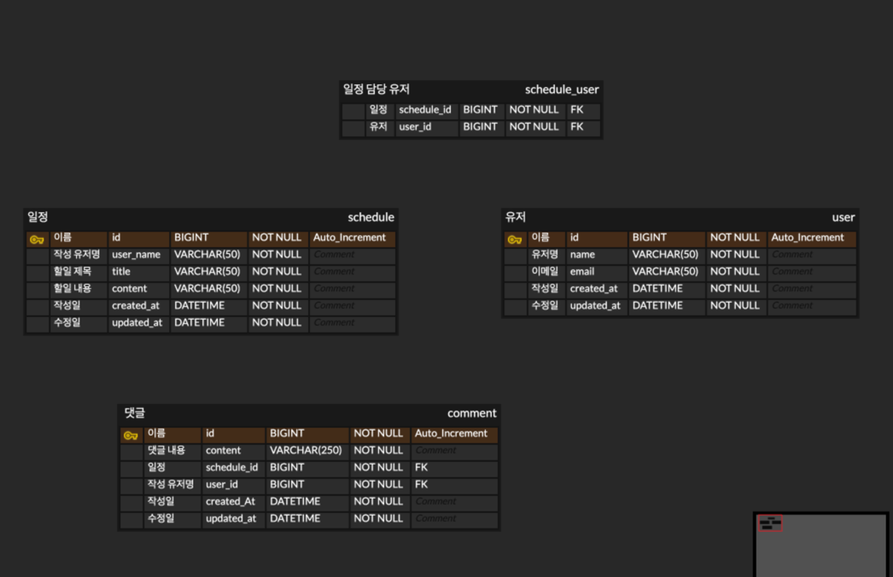

### 개발 전, 공통 조건 

- [ ] 모든 테이블은 고유 식별자(ID)를 가집니다.
- [ ] `3 Layer Architecture` 에 따라 각 Layer의 목적에 맞게 개발합니다.
- [ ] CRUD 필수 기능은 모두 데이터베이스 연결 및  `JPA`를 사용해서 개발합니다.
- [ ] `JDBC`와 `Spring Security`는 사용하지 않습니다.
- [ ] 인증/인가 절차는 `JWT`를 활용하여 개발합니다.
- [ ] JPA의 연관관계는 `양방향`으로 구현합니다.

# API 명세서

## 일정 생성

| 메소드 | URL       | 요청                                                                                                   | 응답    | 응답 코드       | 설명    |
|--------|-----------|------------------------------------------------------------------------------------------------------|-------|-------------|-------|
| POST   | /schedule | `{ "username": "작성 유저", "title": "할일 제목", "content": "할일 내용"}`|   `{ "username": "작성 유저", "title": "할일 제목", "content": "할일 내용", "createdAt" : "작성일" }`| 201 Created | 일정 생성 |

## 일정 단건 조회

| 메소드 | URL           | 요청  | 응답                                                                                                                                                                                                                           | 응답 코드 | 설명               |
|--------|---------------|-----|------------------------------------------------------------------------------------------------------------------------------------------------------------------------------------------------------------------------------|-----------|------------------|
| GET    | /{scheduleId} | ... | `{ "username": "일정 작성 유저", "title": "할일 제목", "content": "할일 내용", "createdAt": "작성일", "updatedAt": "수정일", "comments": [{ "content": "댓글 내용", "createdAt": "댓글 작성일", "updatedAt": "댓글 수정일", "username": "댓글 작성 유저명" }, ...] }` | 200 OK    | 특정 일정 정보를 조회합니다. |

## 일정 전체 조회

| 메소드 | URL        | 요청  | 응답 Body                                                                           | 응답 코드 | 설명            |
|--------|------------|-----|-----------------------------------------------------------------------------------|-----------|---------------|
| GET    | /schedules | ... | `[ {"username": "작성 유저", "title": "할일 제목", "content": "할일 내용", "createdAt" : "작성일", "updatedAt" : "수정일"}, ... ]` | 200 OK    | 일정을 전체 조회합니다. |

## 일정 수정

| 메소드 | URL              | 요청                                               | 응답 Body                                                                 | 응답 코드 | 설명               |
|--------|------------------|----------------------------------------------------|--------------------------------------------------------------------------|-----------|--------------------|
| PUT    | /{scheduleId}     | `{"title": "할일 제목", "content": "할일 내용"}`   | `{ "username": "작성 유저", "title": "할일 제목", "content": "할일 내용", "createdAt" : "작성일", "updatedAt" : "수정일" }` | 200 OK    | 일정을 수정합니다. |

## 일정 삭제

| 메소드    | URL                    | 요청  | 응답  | 응답 코드         | 설명          |
|--------|------------------------|-----|-----|---------------|-------------|
| DELETE | /{scheduleId} | ... | ... | 204 NoContent | 일정을 삭제 합니다. |

## 댓글 생성

| 메소드 | URL      | 요청                                             | 응답                                                                 | 응답 코드       | 설명    |
|--------|----------|------------------------------------------------|--------------------------------------------------------------------|-------------|-------|
| POST   | /comment | `{ "content": "댓글 내용", "username" : "작성 유저명"}` | `{ "content": "댓글 내용", "createdAt" : "작성일", "username" : 작성 유저명 }` | 201 Created | 댓글 생성 |

## 댓글 수정

| 메소드 | URL          | 요청                     | 응답 Body                                                                 | 응답 코드 | 설명         |
|--------|--------------|------------------------|--------------------------------------------------------------------------|-----------|------------|
| PUT    | /{commentId} | `{"content" : "댓글 내용"}` | `{ "content": "댓글 내용", "createdAt" : "작성일", "updatedAt" : "수정일", "username" : 작성 유저명 }` | 200 OK    | 댓글을 수정합니다. |

## 댓글 삭제

| 메소드    | URL                    | 요청  | 응답  | 응답 코드         | 설명          |
|--------|------------------------|-----|-----|---------------|-------------|
| DELETE | /{commentId} | ... | ... | 204 NoContent | 댓글을 삭제 합니다. |

## 일정 조회 페이징

| 메소드 | URL             | 요청 Param                       | 응답                                                                                                                                          | 응답 코드  | 설명 |
|--------|-----------------|--------------------------------|---------------------------------------------------------------------------------------------------------------------------------------------|-----------|------|
| GET    | /schedules/page  | `{"page" : "조회할 페이지 번호" , "size" : "한 페이지에 보여줄 데이터의 개수" }` | `{ "title": "할일 제목", "content" : "할일 내용", "commentCount" : "댓글 개수", "createdAt" : "일정 작성일", "updatedAt" : "일정 수정일", "username" : "작성 유저명" }` | 200 OK    | 일정을 페이지 형식으로 조회합니다. |

## 유저 생성

| 메소드 | URL   | 요청                                                                          | 응답                                                                           | 응답 코드       | 설명    |
|--------|-------|-----------------------------------------------------------------------------|------------------------------------------------------------------------------|-------------|-------|
| POST   | /user | `{ "name": "유저명", "email": "이메일"}` | `{ "name": "유저명", "email": "이메일", "createdAt" : "작성일", "updatedAt" : "수정일" }` | 201 Created | 유저 생성 |

## 유저 조회

| 메소드 | URL       | 요청  | 응답                      | 응답 코드 | 설명            |
|--------|-----------|-----|-----------------------------------------------|-----------|---------------|
| GET    | /{userId} | ... | `{ "name": "유저명", "email": "이메일"}` | 200 OK    | 유저 정보를 조회합니다. |

## 유저 삭제

| 메소드    | URL       | 요청  | 응답  | 응답 코드         | 설명         |
|--------|-----------|-----|-----|---------------|------------|
| DELETE | /{userId} | ... | ... | 204 NoContent | 유저를 삭제 합니다. |

# ERD

